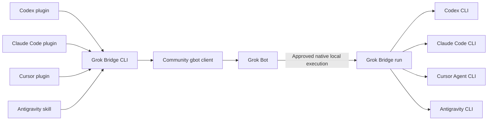

# Architecture and source study

Research date: September 13, 2026. This is an independently written implementation. No reference source code was copied into this repository.

## What the reference actually does

OpenAI's [codex-plugin-cc at db52e28](https://github.com/openai/codex-plugin-cc/tree/db52e28f4d9ded852ab3942cea316258ae4ef346) is a Claude Code plugin backed by a locally authenticated Codex app-server. Its commands and subagent call a Node companion. A detached broker shares the app-server through a Unix socket or Windows named pipe; jobs retain native thread and turn IDs.

| Concern | Reference behavior | Grok Bridge decision |
| --- | --- | --- |
| Host packaging | Claude commands, skills, hooks, subagent | One plugin directory with Codex, Claude, and Cursor manifests and two shared skills; Antigravity uses a dedicated skill wrapper |
| Execution | Persistent JSONL app-server and broker | Bounded native CLI processes with no background service |
| Permissions | Explicit read-only/workspace-write plus `approvalPolicy: never` | Same Codex permission intent; restricted Claude tool sets |
| Completion | Correlated native turn events, main-thread result selection | Codex terminal JSONL; Claude and Cursor structured results; Antigravity terminal NDJSON; Grok request-correlated message marker |
| Follow-up | Native thread resume and job lookup | Explicit native `--session` for coding CLIs; explicit Bot request ID for waiting |
| Cancellation | `turn/interrupt` plus worker cleanup | Local process cleanup; no unsupported claim of remote Grok cancellation |
| Full history transfer | Codex-specific `externalAgentConfig/import` and import-ledger lookup | Omitted; callers deliberately supply a bounded context packet |

Primary source paths: [app-server transport](https://github.com/openai/codex-plugin-cc/blob/db52e28f4d9ded852ab3942cea316258ae4ef346/plugins/codex/scripts/lib/app-server.mjs), [broker](https://github.com/openai/codex-plugin-cc/blob/db52e28f4d9ded852ab3942cea316258ae4ef346/plugins/codex/scripts/app-server-broker.mjs), [job state](https://github.com/openai/codex-plugin-cc/blob/db52e28f4d9ded852ab3942cea316258ae4ef346/plugins/codex/scripts/lib/state.mjs), [task and transfer implementation](https://github.com/openai/codex-plugin-cc/blob/db52e28f4d9ded852ab3942cea316258ae4ef346/plugins/codex/scripts/lib/codex.mjs).

The reference rejects unsupported server-originated approval/input requests. It does not provide a general interactive approval relay. Its transcript importer is specific to Claude-to-Codex and cannot simply be reused in eight directions. These facts drove the smaller initial scope.

## One runner, five adapters



`bin/grok-bridge.js` validates user input before dispatch. It requires an explicit local directory for coding work and a UUID for Bot targeting. Task text is read from a bounded file or stdin. No command is shell-expanded by the runtime.

`src/process.js` limits time and combined output, captures stdin/stdout/stderr, and handles process-tree termination. `src/local.js` constructs destination-native commands and parses their terminal results, with separate Cursor and Antigravity protocol modules. `src/grok.js` isolates the experimental gateway behavior behind the installed `gbot` executable.

The CLI has no HTTP listener, shared credential store, generic remote execution endpoint, daemon, or automatically collected transcript. These omissions keep the initial project small and its host boundary explicit.

## Grok Bot transport

Inspected [grok-bot-cli 0.2.3 at 9192bf8](https://github.com/ScriptedAlchemy/grok-bot-cli/tree/9192bf8f4c05d65abdb568554d3809ec5e4e380f). Its [CLI](https://github.com/ScriptedAlchemy/grok-bot-cli/blob/9192bf8f4c05d65abdb568554d3809ec5e4e380f/src/cli.js) exposes Bot resolution, send, and transcript reads. Its [gateway implementation](https://github.com/ScriptedAlchemy/grok-bot-cli/blob/9192bf8f4c05d65abdb568554d3809ec5e4e380f/src/gateway.js) calls private gateway methods such as `sendPrompt` and `getAgentTranscriptTail`.

Grok Bridge always supplies `--gateway --json`; the upstream filesystem fallback cannot exchange messages. It resolves the supplied UUID and rejects groups before submission. A live acceptance run observed `result.accepted: true`. That acknowledgement is required for `submitted`, and is never treated as completion.

The upstream CLI does not expose caller-controlled idempotency keys, a wait command, or a cancellation API. A send failure may occur after delivery, so there is no automatic retry.

### Observed reply protocol

A sanitized shape from live testing:

```json
{
  "transcript": {
    "entries": [
      {"kind":"message","role":"user","content":"HANDOFF_CHILD: grok-bridge REQUEST_UUID\n...","requestId":"SERVER_UUID","isStreaming":false},
      {"kind":"send-message","requestId":"SERVER_UUID","message":{"type":"text","content":"Result\nGROK_BRIDGE_DONE:REQUEST_UUID"}}
    ]
  }
}
```

Waiting locates exactly one user entry with the request prefix, obtains its server request ID, then accepts a terminal marker only in a later `send-message` text response sharing that ID. It rejects ambiguous matches, multiple terminal replies, empty results, mismatched Bot IDs, and unsupported shapes. It does not search arbitrary nested strings for a success token.

This is an observed private transcript shape plus a bridge-defined response convention. The provider does not publish it as a stable task-status API. A final marker remains the destination's report, not independent proof of a correct implementation.

## Execution host and authentication

Official [Grok Bot computer documentation](https://docs.x.ai/grok-bot/computer-and-apps) separates the persistent, account-shared cloud computer from the user's local computer. [Local execution policy](https://docs.x.ai/grok-bot/approvals-security-and-privacy) controls commands on the user's computer. Grok Bridge uses that existing feature for reverse handoffs when it is available and approved.

Cloud execution is a separate deployment with its own CLI installs, logins, and repository clone. A path on the user's Mac is not automatically available in `/workspace`. Bot skills are saved through the documented [Bot skill workflow](https://docs.x.ai/grok-bot/skills-routines-and-automations). Grok Build's plugin filesystem is not a Bot install contract.

Coding execution follows [Codex noninteractive mode](https://developers.openai.com/codex/noninteractive) and [Claude Code programmatic mode](https://code.claude.com/docs/en/headless). Native configuration and subscriptions belong to those products. A process launch, installed executable, or passing mock test does not prove provider access.

## Release boundaries

The alpha intentionally omits a persistent job broker, live approval forwarding, automatic workspace synchronization, full-history import, automatic retries, and reciprocal background loops. Future work needs a demonstrated use case and destination-specific evidence, especially before adding a public Bot transport or claiming Windows support.

## Additional coding destinations

Cursor uses the official `agent` CLI with JSON output, an explicit workspace, and `--sandbox enabled`. Review selects Ask mode; explicit work adds the documented force flag so edits can run. The prompt is one literal argument because prompt-through-stdin was not established. Native result parsing requires its documented successful terminal object. See [Cursor parameters](https://cursor.com/docs/cli/reference/parameters), [headless mode](https://cursor.com/docs/cli/headless), and [output formats](https://cursor.com/docs/cli/reference/output-format).

Antigravity uses the actual `agy` CLI with one NDJSON user message and a terminal result, under native plan or accept-edits mode. Its plan mode is not a hard read-only security boundary. Permission denials can coexist with a returned response, so the parent still verifies task acceptance. See [Antigravity headless mode](https://antigravity.google/docs/cli/headless/) and the [setup guide](antigravity-setup.md).
